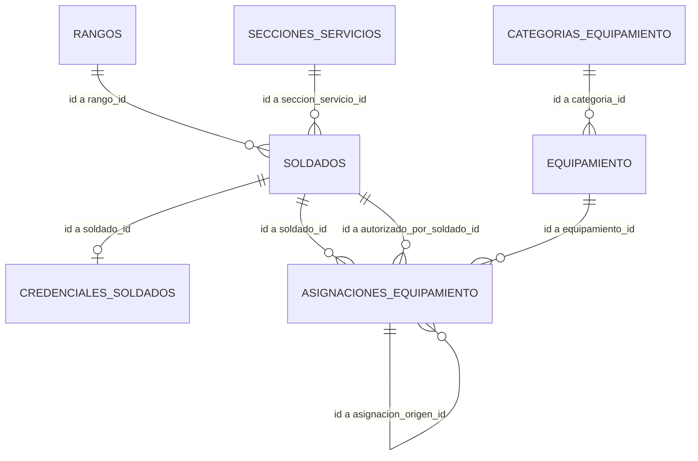

# 🗄️ Guía de Desarrollo: Integración de Turso DB (Local-First & Cifrado)

Esta guía documenta los aprendizajes, las decisiones de arquitectura y la implementación técnica del motor de base de datos local Turso DB (libsql) y el esquema de almacenamiento relacional cifrado en el proyecto **Armadillos**.

---

## 1. Contexto y Decisiones de Arquitectura

Durante la fase de desarrollo del proyecto, decidimos implementar Turso DB en su modalidad local-first y cifrada. Esta decisión se tomó evaluando los siguientes aspectos:

- **Seguridad en Memoria (Rust-Native):** A diferencia de SQLite tradicional, que está escrito en C y requiere enlaces FFI (`unsafe`), el nuevo motor de Turso está escrito enteramente en Rust.
- **Asincronía Nativa:** Soporta `async/await` de forma nativa sin bloquear el hilo principal de ejecución de Tokio, lo que evita delegar tareas a pools de bloqueo externos.
- **Cifrado de Base de Datos TursoDB:** Configuramos el cifrado de página nativo en reposo de Turso (`Aegis256`) utilizando la clave maestra simétrica del sistema.
- **Privacidad Absoluta:** No se utilizan las características de sincronización en la nube (Turso Cloud), confinando la base de datos exclusivamente al archivo local `armadillos.db` en el disco.

---

## 2. Estructura de la Base de Datos (Esquema 3FN Normalizado)

El esquema se inicializa automáticamente al arrancar la aplicación mediante el módulo `src/db/database.rs`, el cual ejecuta todas las sentencias DDL y datos semilla como una transacción atómica explícita (`BEGIN TRANSACTION` y `COMMIT`).

Las tablas están diseñadas en **Tercera Forma Normal (3FN)** para eliminar redundancias y dependencias transitivas.

---

## 3. Catálogos y Tablas de Lookup

### Tabla: `rangos`

Catálogo oficial de rangos militares mexicanos (SEDENA/SEMAR).

| Campo | Tipo | Restricción | Descripción |
| :--- | :--- | :--- | :--- |
| `id` | INTEGER | PRIMARY KEY AUTOINCREMENT | Identificador único del rango |
| `nombre` | TEXT | NOT NULL UNIQUE | Nombre oficial (ej: "Subteniente") |
| `categoria` | TEXT | NOT NULL | Categoría SEDENA (Tropa, Clases, Oficiales, Jefes, Generales) |
| `orden_jerarquico` | INTEGER | NOT NULL UNIQUE | Nivel numérico de menor a mayor (1-15) para validación ABAC |

### Tabla: `secciones_servicios`

Catálogo de secciones u órganos militares de un plantel.

| Campo | Tipo | Restricción | Descripción |
| :--- | :--- | :--- | :--- |
| `id` | INTEGER | PRIMARY KEY AUTOINCREMENT | Identificador único del servicio |
| `nombre` | TEXT | NOT NULL UNIQUE | Nombre de la sección (ej: "Materiales de Guerra") |
| `es_servicio_belico` | INTEGER | NOT NULL DEFAULT 0 | Flag ABAC: 1 si tiene privilegios para material de guerra |

### Tabla: `categorias_equipamiento`

Clasificación de tipos de equipamiento para aplicar controles de acceso.

| Campo | Tipo | Restricción | Descripción |
| :--- | :--- | :--- | :--- |
| `id` | INTEGER | PRIMARY KEY AUTOINCREMENT | Identificador único |
| `nombre` | TEXT | NOT NULL UNIQUE | Nombre de la categoría (ej: "Armamento", "Municiones") |
| `es_material_de_guerra` | INTEGER | NOT NULL DEFAULT 0 | Flag ABAC: 1 si requiere permisos bélicos para su control |

---

## 4. Tablas Operativas y de Control

### Tabla: `soldados`

Contiene la información del personal militar. Nombres y matrícula se guardan cifrados (ALE) para evitar fugas de información.

| Campo | Tipo | Restricción | Descripción |
| :--- | :--- | :--- | :--- |
| `id` | INTEGER | PRIMARY KEY AUTOINCREMENT | Identificador único del soldado |
| `matricula_blind_index` | TEXT | NOT NULL UNIQUE | Hash Keyed BLAKE3 de la matrícula para búsquedas directas |
| `matricula_encriptada` | TEXT | NOT NULL | Matrícula cifrada con ChaCha20-Poly1305 |
| `nombre_encriptado` | TEXT | NOT NULL | Nombre de pila cifrado con ChaCha20-Poly1305 |
| `apellido_paterno_encriptado` | TEXT | NOT NULL | Apellido paterno cifrado con ChaCha20-Poly1305 |
| `apellido_materno_encriptado` | TEXT | (nullable) | Apellido materno cifrado (opcional) |
| `rango_id` | INTEGER | NOT NULL FK → `rangos(id)` | Identificador del rango del militar |
| `seccion_servicio_id` | INTEGER | NOT NULL FK → `secciones_servicios(id)` | Identificador de la sección asignada |
| `estado` | TEXT | NOT NULL DEFAULT 'Activo' | Estado (Activo, Licencia, Retirado) |

### Tabla: `credenciales_soldados`

Almacena la información de autenticación segura para el inicio de sesión.

| Campo | Tipo | Restricción | Descripción |
| :--- | :--- | :--- | :--- |
| `soldado_id` | INTEGER | PRIMARY KEY FK → `soldados(id)` | Vinculación 1:1 con el soldado (ON DELETE CASCADE) |
| `usuario` | TEXT | NOT NULL UNIQUE | Nombre de usuario para el inicio de sesión |
| `password_hash` | TEXT | NOT NULL | Contraseña cifrada con Argon2id |

### Tabla: `equipamiento`

Inventario físico del plantel.

| Campo | Tipo | Restricción | Descripción |
| :--- | :--- | :--- | :--- |
| `id` | INTEGER | PRIMARY KEY AUTOINCREMENT | Identificador único del material |
| `codigo_inventario` | TEXT | NOT NULL UNIQUE | Código de control interno (ej: "ARM-001") |
| `nombre` | TEXT | NOT NULL | Nombre descriptivo del material |
| `descripcion` | TEXT | (nullable) | Detalles del material |
| `categoria_id` | INTEGER | NOT NULL FK → `categorias_equipamiento(id)` | Categoría asignada |
| `estado_conservacion` | TEXT | NOT NULL DEFAULT 'Operativo' | Estado físico (Operativo, EnMantenimiento, DeBaja) |
| `stock_total` | INTEGER | NOT NULL DEFAULT 0 | Inventario total asignado al plantel |
| `stock_disponible` | INTEGER | NOT NULL DEFAULT 0 | Inventario libre en armería (no asignado) |

### Tabla: `asignaciones_equipamiento`

Bitácora inmutable en forma de libro mayor (Ledger) con encadenamiento criptográfico. **Solo admite operaciones `INSERT`**.

| Campo | Tipo | Restricción | Descripción |
| :--- | :--- | :--- | :--- |
| `id` | INTEGER | PRIMARY KEY AUTOINCREMENT | Identificador del evento |
| `tipo_evento` | TEXT | NOT NULL | Tipo de transacción: `ASIGNACION` o `DEVOLUCION` |
| `soldado_id` | INTEGER | NOT NULL FK → `soldados(id)` | Soldado receptor o emisor del equipo |
| `equipamiento_id` | INTEGER | NOT NULL FK → `equipamiento(id)` | Material entregado o retornado |
| `cantidad` | INTEGER | NOT NULL DEFAULT 1 | Cantidad entregada o devuelta |
| `fecha_evento` | TEXT | NOT NULL DEFAULT datetime('now') | Timestamp UTC de la operación |
| `autorizado_por_soldado_id` | INTEGER | NOT NULL FK → `soldados(id)` | Oficial u operador que autoriza el evento |
| `asignacion_origen_id` | INTEGER | FK → `asignaciones_equipamiento(id)` | Enlace a la asignación de origen si es `DEVOLUCION` |
| `hash_verificacion` | TEXT | NOT NULL | Hash BLAKE3 del bloque actual encadenado al anterior |

---

## 5. Compartir Conexiones en Axum

El objeto de base de datos (`turso::Database`) representa el archivo en el disco y es seguro para ser compartido entre múltiples hilos de ejecución (`Send + Sync`).

Para implementarlo correctamente en Axum:

1. Se empaqueta en una estructura inteligente de tipo `Arc` (Atomic Reference Counting) dentro del estado de la aplicación.
2. Se inyecta al router mediante `.with_state(state)`.
3. Cada handler obtiene una referencia y abre una conexión local temporal mediante `state.db.connect()`, garantizando la concurrencia y la liberación oportuna de recursos.
